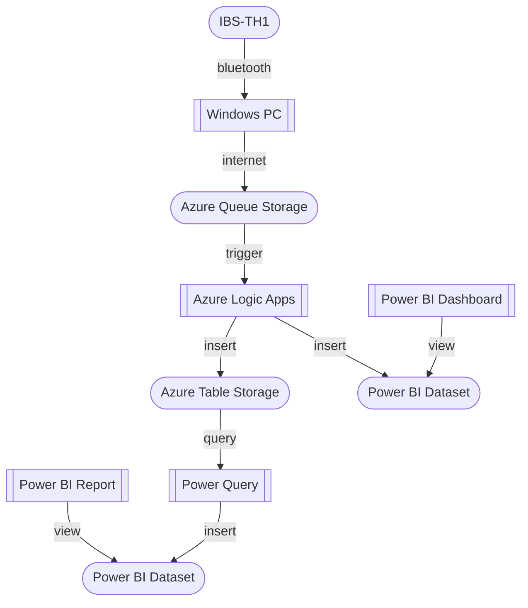

# Inkbird

Inkbird (IBS-TH1) から温度と湿度を取得して Power BI ダッシュボードに表示します。

## アーキテクチャ

```mermaid
flowchart TB

A([IBS-TH1]) -->|bluetooth| B
B[[Windows PC]] -->|internet| C
C([Azure Queue Storage]) -->|trigger| D
D[[Azure Logic Apps]] -->|insert| E
E([Azure Table Storage]) -->|query| F
G[[Power BI Report]] -->|view| H
F[[Power Query]] -->|insert| H
H([Power BI Dataset])
D[[Azure Logic Apps]] -->|insert| I
I([Power BI Dataset])
J[[Power BI Dashboard]] -->|view| I
```
